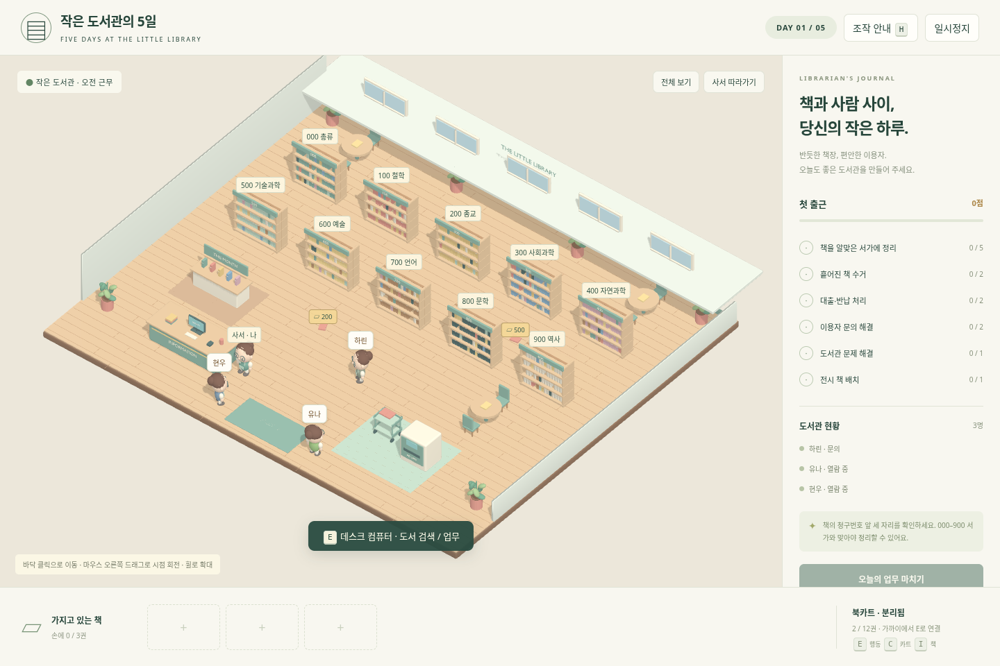

# 작은 도서관의 5일 · library99

Blender로 직접 만든 도서관, 2등신 사서와 북카트를 사용하는 브라우저 3D 게임 프로토타입입니다. 외부 런타임이나 CDN 없이 WebGL2로 GLB 모델을 렌더링합니다. 스타일은 따뜻한 목재와 부드러운 색상의 로우폴리 디오라마입니다.



## 가장 간단하게 실행하기

1. 저장소의 **Code → Download ZIP**으로 파일을 내려받고 압축을 풉니다.
2. **`dist/play.html`을 Chrome 또는 Edge에서 엽니다.** 이 파일에는 코드와 3D 모델이 모두 들어 있어 인터넷이나 Python 설치가 필요 없습니다.
3. `첫 근무 시작하기`를 눌러 시작합니다. WebGL2와 브라우저 하드웨어 가속이 필요합니다.

파일 실행을 브라우저 정책이 막는 경우 Python 3가 설치된 PC에서 `python serve.py`를 실행합니다. 개발용 분리 파일인 `dist/index.html`은 로컬 HTTP 서버 또는 정적 호스팅에서 실행합니다.

## 구현된 게임

- **000 총류 / 100 철학 / 200 종교 / 300 사회과학 / 400 자연과학 / 500 기술과학 / 600 예술 / 700 언어 / 800 문학 / 900 역사**: 총 10개 서가. 책 청구번호와 서가가 일치해야 정리됩니다.
- 조작 가능한 2등신 사서: 입체 얼굴, 안경, 머리카락, 앞치마, 걷는 팔다리.
- 도서관 배경: 목재 바닥, 창문, 식물, 열람 테이블과 의자, 전시 공간, 사서 데스크, 컴퓨터, 반납기.
- 반납기 옆 **북카트**: 연결/분리, 최대 12권 적재, 책을 담은 채 이동. 손에 최대 3권을 들 수 있습니다.
- 바닥에 흩어진 책 줍기, 반납기 책 수거, 카트와 손 사이 이동, 서가 정리, 책 전시.
- 돌아다니는 이용자, 사서를 따라와 질문하는 이용자, 데스크에서 기다리는 이용자.
- 분야에 맞는 서가 안내, 회원증/바코드 확인 대출, 반납 등록. 해결된 이용자는 출구로 이동합니다.
- 프린터 연결 문제/반납기 막힘 접수와 해결.
- 5일간의 업무 목표, 날짜별 책 수 증가, 점수, 근무 완료 화면과 브라우저 자동 저장.
- 충돌 처리와 통로 기반 경로 찾기, 바닥 클릭 이동, 확대/축소, 회전, 사서 추적 시점.
- 작은 화면의 방향 버튼과 상호작용 버튼.

## 조작

| 조작 | 기능 |
| --- | --- |
| WASD / 방향키 | 화면 기준 사서 이동 |
| 바닥 클릭 | 장애물을 피해 이동 |
| E | 가까운 물체·이용자와 상호작용 |
| C | 가까운 북카트 연결 / 놓기 |
| I | 책 목록, 손/카트 사이 책 이동 |
| 책 목록 클릭 | 서가에 정리하거나 전시할 책 선택 |
| Q / R | 카메라 회전 |
| 오른쪽 드래그 | 카메라 회전 |
| 마우스 휠 | 확대 / 축소 |
| H | 조작 안내 |
| P / Esc | 일시정지, 열린 창 닫기 |

각 날짜에는 책 정리·흩어진 책 수거·대출/반납·문의·문제 해결·전시 목표가 있습니다. 전부 달성하면 `오늘의 업무 마치기`로 다음 날짜를 시작합니다. 프린터/반납기의 고장은 이용자의 문제를 접수한 뒤 해당 기기의 메뉴에서 해결합니다.

## 원본 3D 파일

- **`models/library.blend`**: 도서관, 캐릭터와 북카트를 편집할 수 있는 Blender 4.3 원본.
- **`models/build_scene.py`**: 모델과 배치 파일을 재생성하는 Blender Python 스크립트.
- **`dist/assets/library.glb`**: 도서관 배경과 서가/가구.
- **`dist/assets/librarian.glb`**: 사서 및 움직임용 분리 팔다리. 이용자는 동일한 베이스 모델을 다른 색상으로 사용합니다.
- **`dist/assets/cart.glb`**, **`book.glb`**: 독립된 북카트와 책.
- **`dist/assets/layout.json`**: 서가 위치, 시설 위치와 충돌 영역.
- **`models/preview.png`**: Blender 렌더 이미지. `game-desktop.png`는 실제 WebGL 게임 화면입니다.

재생성: `blender -b -t 4 -P models/build_scene.py`

## 개발 및 검증

Node.js가 있으면 `npm test`, `npm run check`로 분류/정리, 운반 용량, 5일 목표의 책 수, 서가 접근 경로, 충돌 조건을 검사합니다. `tests/browser_qa.py`는 Playwright가 설치된 환경에서 실행하는 브라우저 통합 검증 스크립트입니다.

단일 HTML 및 ZIP 재생성: `python scripts/package.py`

```text
dist/       웹 게임, 단일 실행 HTML, GLB 모델
models/     Blender 원본, 모델 제작 코드, 미리보기
tests/      업무 로직/경로 테스트, 브라우저 검증 코드
scripts/    단일 파일 및 ZIP 생성
serve.py    선택적인 로컬 실행 도구
```

이 버전은 확장 가능한 프로토타입입니다. 대출/반납은 게임 내 시뮬레이션이며 실제 도서관 시스템에 연결하지 않습니다. 문의는 선택형 분류 안내, 문제 해결은 메뉴 기반입니다. 자유 대화 AI, 세밀한 캐릭터 리깅, 방문자별 독립 외형, 물리 엔진은 포함하지 않습니다. 진행 상황은 같은 브라우저에 저장되며 계정 간 동기화는 없습니다.
